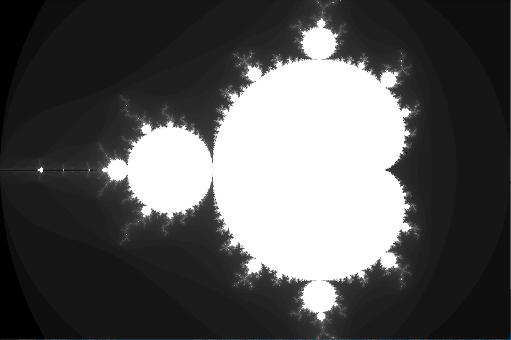
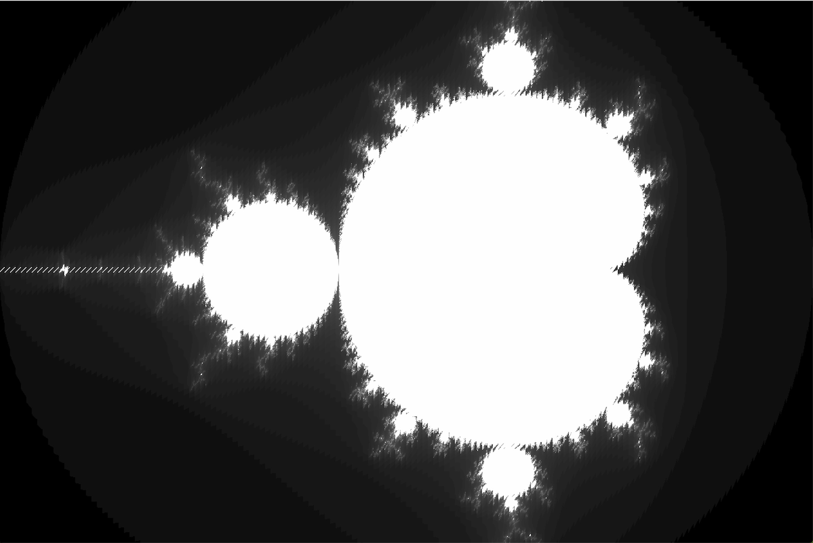

# Parallel Programming Homework

## Introduction

This homework includes three projects:

**mandelbrot_threads** requires us to calculate and draw a *Mandelbrot Fractal* using parallel computing of multithreads. We implement this by using `pthread` in Mac OS.

**vecintrin** requires us to use the virtual intrinsic provided by *CMU418* program to make exponent and sum calculation.

**prog3\_mandelbrot\_threads\_avx2** requires us to use *AVX2* instructions to speed up the calculation of the *Mandelbrot Fractal*. We implement this by vectorizing some intructions in function `mandel` and `mandelbrotSerial`.

## mandelbrot_threads

### Build

```shell
$ g++-7 mandelbrot.cpp -o main -pthread
```

### Run

```shell
$ ./main
```

### Result

After running the program, you will get two same pictures of *Mandelbrot Fractal*, one from serial computing and another from parallel computing:



Next, we compare the performance of using 2, 4, 8 and 16 threads:

**for 2 threads:**

```shell
[mandelbrot serial]:            [494.358] ms
Wrote image file mandelbrot-serial.ppm

[mandelbrot thread]:            [242.969] ms
Wrote image file mandelbrot-thread.ppm
                                (2.03x speedup from 2 threads)
```

**for 4 threads:**

```
[mandelbrot serial]:            [495.753] ms
Wrote image file mandelbrot-serial.ppm

[mandelbrot thread]:            [218.463] ms
Wrote image file mandelbrot-thread.ppm
                                (2.27x speedup from 4 threads)
```

**for 8 threads:**

```
[mandelbrot serial]:            [497.027] ms
Wrote image file mandelbrot-serial.ppm

[mandelbrot thread]:            [201.976] ms
Wrote image file mandelbrot-thread.ppm
                                (2.46x speedup from 8 threads)
```

**for 16 threads:**

```
[mandelbrot serial]:            [493.507] ms
Wrote image file mandelbrot-serial.ppm

[mandelbrot thread]:            [200.918] ms
Wrote image file mandelbrot-thread.ppm
                                (2.46x speedup from 16 threads)
```

From the result above we can conclude that as the number of threads increases, the performance also improves. But there is little difference between the performance of using 8 threads and 16 threads, thus we thought that in this program the highest performance can be reached by using 8 threads.

## vecintrin

### Build

```shell
$ g++-7 CMU418intrinsic.cpp -o main
```

### Run

```shell
$ ./main

CLAMPED EXPONENT (required)
Results matched with answer!
****************** Printing Vector Unit Statistics *******************
Vector Width:              4
Total Vector Instructions: 77
Vector Utilization:        84.415584%
Utilized Vector Lanes:     260
Total Vector Lanes:        308
************************ Result Verification *************************
Passed!!!

ARRAY SUM (bonus)
Passed!!!
```

## prog3\_mandelbrot\_threads\_avx2

### Build

```shell
g++-7 -g -Wall -mavx2 mandelbrot_avx2.cpp -o main
```

### Run

```shell
./main
```

### Result

After running the program, you will get two same pictures of *Mandelbrot Fractal*, one from serial computing and another from parallel computing:



Comparing this result with the first project **mandelbrot_threads**, something interesting happened. It seems that after using *AVX2* to vectorize the program, we got a oscillatory result image.

Next, we compare the performance of using 2, 4, 8 and 16 threads:

**for 2 threads:**

```shell
[mandelbrot serial]:            [262.699] ms
Wrote image file mandelbrot-serial.ppm

[mandelbrot thread]:            [138.122] ms
Wrote image file mandelbrot-thread.ppm
                                (1.90x speedup from 2 threads)
```

**for 4 threads:**

```
[mandelbrot serial]:            [262.529] ms
Wrote image file mandelbrot-serial.ppm

[mandelbrot thread]:            [131.024] ms
Wrote image file mandelbrot-thread.ppm
                                (2.00x speedup from 4 threads)
```

**for 8 threads:**

```
[mandelbrot serial]:            [268.700] ms
Wrote image file mandelbrot-serial.ppm

[mandelbrot thread]:            [126.800] ms
Wrote image file mandelbrot-thread.ppm
                                (2.12x speedup from 8 threads)
```

**for 16 threads:**

```
[mandelbrot serial]:            [271.929] ms
Wrote image file mandelbrot-serial.ppm

[mandelbrot thread]:            [119.252] ms
Wrote image file mandelbrot-thread.ppm
                                (2.28x speedup from 16 threads)
```

Also, we compare the performance with the first project **mandelbrot_threads**. We can see that by vectorizing the program with *AVX2*, the performance is 2 times as better as the first project.